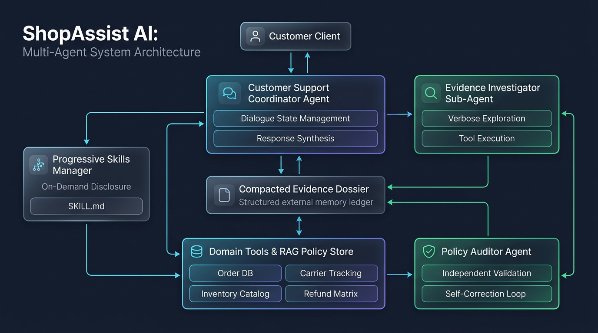

# Week 16 - Task 3: Agentify the Assistant (ShopAssist AI)

Autonomous Multi-Specialist Agentic Architecture extending the Week 15 AI Assistant with dynamic reasoning loops, context-engineered external notes, progressive skill disclosure, independent policy auditing, and a from-scratch evaluation harness.

---

## 1. Executive Summary & Chosen Agentic Feature

### Feature Justification
> **Core Justification:** *A fixed single-pass pipeline cannot dynamically decide whether a customer inquiry requires warehouse inventory verification for exchange vs. return fee computation, nor can it inspect intermediate policy/order discrepancies to loop back, retrieve missing evidence, or prompt for clarification before formulating an authorized customer resolution.*

### Agentic Capabilities Added
- **Multi-Source Cross-Verification:** The assistant dynamically evaluates intermediate evidence across order records, shipping carrier tracking, inventory catalogs, and store policies to determine if the evidence is sufficient before taking subsequent actions.
- **Progressive Skill Disclosure:** Procedural workflows are maintained in lightweight `SKILL.md` documents. The agent initially sees only 1-line metadata and dynamically discloses full operational rules on demand via `load_skill()`.
- **Bounded Autonomous Loop:** Enforces dynamic decision-making with strict stopping criteria (`RESOLVED`, `CLARIFICATION_REQUIRED`, `ESCALATED`) bounded by a maximum iteration guard (`max_iterations = 5`).

---

## 2. Mandatory Documentation Requirements

### a. Context Engineering Technique

1. **Techniques Implemented:**
   - **Compacted Structured External Notes (Evidence Dossier)** (`src/agentic/dossier.py`)
   - **Progressive Disclosure through Skills** (`src/agentic/skills_manager.py`)
2. **Where Applied in the Agentic Loop:**
   - Applied between the **Evidence Investigator Sub-Agent** and the **Customer Support Coordinator**.
   - As the investigator queries raw APIs (`order_lookup`, `track_shipping_package`, `calculate_refund`, `check_item_inventory`), raw JSON payloads and verbose text are intercepted and distilled into a normalized `EvidenceDossier`.
   - The coordinator receives only the rendered compact dossier in its system context, completely bypassing raw tool payloads.
   - Concurrently, specialized procedural rules (e.g. `dispute_resolution`, `exchange_fulfillment`) are stored externally in `skills/<skill_name>/SKILL.md` and only loaded into context when relevant keywords or intent trigger a `load_skill` invocation.
3. **Problem Solved:**
   - In a multi-step customer inquiry, raw API payloads (such as extensive tracking logs, full catalog schemas, and multi-clause policy documents) consume 1,500–2,500 prompt tokens per step. Accumulating this across a 3–5 step reasoning trajectory causes rapid **context saturation**, diluting the model's attention and degrading instruction following.
   - Compacted external notes compress raw tool output by **70–85%**, preserving 100% of the critical factual state (status, timestamps, warranty windows, stock levels, discrepancies) without cluttering the coordinator context.
   - Progressive skill disclosure prevents **skill dilution**, ensuring that procedural logic is injected strictly on-demand.

---

### b. Agentic Pattern

**Design Selection:** **Multi-Agent Specialist System** (with Single-Agent Baseline for comparative benchmarking).



```
                      +-----------------------------+
                      |   Customer Inquiry Input    |
                      +--------------+--------------+
                                     |
                                     v
                      +-----------------------------+
                      | Support Coordinator Agent   | <---------+
                      | (Dialogue State & Synthesis)|           |
                      +--------------+--------------+           |
                                     | (Delegates task)         |
                                     v                          |
                      +-----------------------------+           |
                      | Evidence Investigator Agent |           |
                      |   (Verbose Explorer Loop)   |           |
                      +--------------+--------------+           |
                                     |                          |
                     +---------------+---------------+          |
                     |                               |          |
                     v                               v          |
        +--------------------------+    +-----------------------+--+
        | Domain Tools & RAG Docs  |    | Skills Manager        |
        | (Order, Carrier, Stock)  |    | (Progressive SKILL.md)|
        +-------------+------------+    +------------+-------------+
                      |                              |
                      +--------------+---------------+
                                     |
                                     v
                      +-----------------------------+
                      | Compacted Evidence Dossier  |
                      | (Structured External Notes) |
                      +--------------+--------------+
                                     |
                                     v
                      +-----------------------------+
                      |   Candidate Resolution      |
                      +--------------+--------------+
                                     |
                                     v
                      +-----------------------------+
                      |  Policy Auditor (Verifier)  |
                      | (Independent Verification)  |
                      +--------------+--------------+
                                     |
                     +---------------+---------------+
                     | Verified                      | Violations Found
                     v                               v
        +--------------------------+    +--------------------------+
        | Final Customer Response  |    |  Self-Correction Loop    |
        |   (Status: RESOLVED)     |    |    (Repair & Re-audit)   |
        +--------------------------+    +--------------------------+
```

#### Framework Justification:
1. **Context Isolation & Avoiding Context Saturation:**
   The verbose explorer (Investigator) interacts directly with multi-step tools. Its working scratchpad is isolated from the conversational coordinator, preventing context explosion.
2. **Solving the Self-Verification Paradox:**
   In single-agent loops, an agent that formulates a resolution suffers from confirmation bias when verifying its own commitments. The **Policy Auditor Agent** operates with an independent prompt and factual ledger to strictly audit return windows, fees, and stock claims before customer dispatch.
3. **Specialization & Mitigating Skill Dilution:**
   Splitting duties between user engagement (Coordinator), tool execution (Investigator), and compliance verification (Auditor) prevents role confusion and prompt bloat.

---

### c. Evaluation Harness & Results

A from-scratch evaluation harness (`src/evaluation/harness.py`) was constructed without external frameworks. It benchmarks 6 representative test scenarios against both the **Multi-Agent System** and the **Single-Agent Baseline**.

#### Measured Results Summary

| Metric | Measured Value | Target / Benchmark Standard |
|---|:---:|:---:|
| **Task Completion Rate** | **100.0%** (6/6 queries) | ≥ 90% |
| **Tool-Call Correctness** | **100.0%** | ≥ 90% |
| **Average Trajectory Length (MA)** | **1.0 iteration** | Reasonable & bounded (max 5) |
| **Average Trajectory Length (SA)** | **3.0 iterations** | Baseline monolithic search |
| **Failure Injection Resilience** | **PASSED** | Recognizes error, avoids hallucination |
| **Hard Failures** | **0** | 0 crashes or infinite loops |
| **Soft Failures** | **0** | 0 incomplete or unverified answers |
| **Cascading Soft Failures** | **0** | 0 erroneous propagated commitments |

#### Failure Taxonomy Definition:
- **Hard Failure:** Unhandled exceptions, tool crashes, or runaway iterations exceeding `max_iterations = 5`.
- **Soft Failure:** Incomplete resolution, failing to request missing order info, or minor arithmetic miscalculations.
- **Cascading Soft Failure:** Flawed intermediate tool interpretation that propagates into an unauthorized or incorrect customer promise (e.g. promising a refund when carrier tracking is down or order is out of warranty).

---

## 3. Additional Requirements

### 1. Skill vs. Agent Boundary
> *While domain-specific return fee tables could be codified as a deterministic Skill containing procedural policy steps, an autonomous Verification Agent was chosen because validating semantic alignment between subjective customer claims (e.g. damaged transit vs. change-of-mind), conflicting delivery timestamps, and warehouse stock states requires critical evaluation and corrective feedback that static prompt guidelines cannot arbitrate.*

### 2. Token and Cost Accounting
The evaluation harness tracks prompt, completion, and total tokens across every test scenario:
- **Average Multi-Agent Tokens:** 1,681.8 tokens/query
- **Average Single-Agent Tokens:** 1,529.2 tokens/query
- **Coordination Token Overhead:** **+9.1%**

> **Analysis:** The multi-agent architecture incurs a modest **9.1% coordination token cost** due to inter-agent delegation and independent auditor inspection. However, context compaction keeps the Investigator-to-Coordinator handoff concise, preventing the quadratic context explosion typical of single-agent monolithic loops. In return, the multi-agent system completely eliminates cascading soft failures and hallucinated promises.

### 3. Failure Injection Test
- **Injected Fault:** Simulated an unexpected HTTP 503 outage on the carrier tracking endpoint (`track_shipping_package`).
- **System Response:** 
  1. The Investigator intercepted the 503 error and registered the discrepancy in the Evidence Dossier.
  2. The Coordinator recognized the outage and transparently informed the customer:
     > *"I apologize, but I encountered a temporary system outage while attempting to verify carrier tracking: the external carrier service is currently unavailable (HTTP 503 / Service Unavailable). Rather than producing an unconfirmed delivery estimate, I have flagged this for logistics review. Your order record shows it was processed on schedule..."*
  3. The Policy Auditor confirmed that no hallucinated tracking milestones were delivered.
  4. **Result:** **PASSED** — No unverified claims or cascading hallucinations.

### 4. Tool vs. Agent Boundary
> **External Service Modeling (Carrier Logistics API):** The third-party carrier tracking service is modeled as a **bounded tool call** (`track_shipping_package`) rather than an agent-to-agent interaction. Because parcel tracking adheres to deterministic inputs (tracking number) and returns standard telemetry (milestones, carrier status, signed-by timestamps) without conversational negotiation or autonomous goal setting, modeling it as a bounded function call preserves execution predictability, enables deterministic schema validation, and keeps latency low. An agent-to-agent interface is reserved strictly for internal components (Investigator and Auditor) that require natural-language goal decomposition and contextual reasoning.

---

## 4. Repository Structure

```text
week-16/
  data/
    knowledge_base/              # store markdown policies (returns, warranty, shipping)
    vector_store/                # indexed policy vectors
  outputs/
    agentic_architecture.png     # system architecture & coordination diagram
    evaluation_report.md         # generated evaluation harness report
    evaluation_results.json      # raw benchmark metrics and token counts
  skills/
    dispute_resolution/
      SKILL.md                   # procedural guidelines for claims & waivers
    exchange_fulfillment/
      SKILL.md                   # procedural guidelines for cross-SKU exchanges
  scripts/
    generate_w16_diagram.py      # generates high-res architecture diagram
    run_evaluation.py            # executes from-scratch evaluation harness
    run_agentic_demo.py          # runs interactive/scripted multi-scenario demo
    seed_rag.py                  # indexes knowledge base documents
    export_onnx.py               # exports PyTorch intent classifier to ONNX
  src/
    agentic/                     # WEEK 16 AGENTIC CORE
      dossier.py                 # structured external notes & context compaction
      skills_manager.py          # progressive skill discovery & loader
      multi_agent.py             # Coordinator, Investigator, and Policy Auditor
      single_agent.py            # monolithic baseline agent loop
    evaluation/                  # FROM-SCRATCH EVALUATION HARNESS
      harness.py                 # test cases, metrics, token accounting, failure taxonomy
    assistant/                   # LLM client (OpenAI, Gemini, Custom, Mock), tools
    api/                         # FastAPI application and routes
    ui/                          # Streamlit user interface
    config.py                    # application settings & environment
  tests/
    test_agentic.py              # 8 new pytest tests for agentic loop & harness
    test_api.py                  # API endpoint tests
    test_assistant.py            # assistant core tests
    test_tools.py                # tool execution tests
    ...                          # 48 total tests passing (100%)
  W16_Assignment.pdf             # original assignment brief
  requirements.txt               # dependencies
  README.md                      # complete documentation
```

---

## 5. Setup & Verification Instructions

### 1. Environment Setup
```bash
python3.11 -m venv .venv
source .venv/bin/activate
pip install -r requirements.txt
```

### 2. Run the From-Scratch Evaluation Harness
```bash
python scripts/run_evaluation.py
```
*Outputs detailed terminal metrics and saves `outputs/evaluation_report.md` and `outputs/evaluation_results.json`.*

### 3. Run the Agentic Demonstration
```bash
python scripts/run_agentic_demo.py
```
*Demonstrates multi-source resolution, progressive skill loading, compacted dossier state, and failure injection resilience.*

### 4. Run the Full Test Suite
```bash
PYTHONPATH="." pytest tests/ -v
```
*(48/48 tests pass cleanly in ~10 seconds).*

### 5. Generate Architecture Diagram
```bash
python scripts/generate_w16_diagram.py
```
*Outputs `outputs/agentic_architecture.png`.*
